# '확실히 정상'으로 자동 버려졌지만 실제로는 GT인 채널들

3분할 구조(High/애매함/Low)에서 Low tier(z<=1.28, VLM한테 보여주지도 않고 버리는 구간)에 들어간 GT 채널 94개 중, 여기 94개가 23개 세그먼트에 걸쳐 있습니다. 굵은 선 = 놓친 GT 채널(z값 표시), 빨간 음영 = 실제 이상 구간.

## machine-1-2 [15415-15418] (k=1, 놓친 채널 1개)

- 놓친 채널(z): [(17, 1.0)]

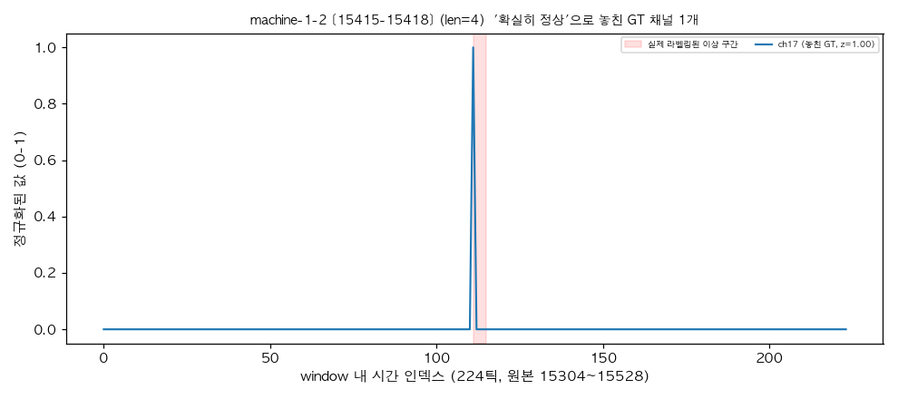

## machine-1-3 [1257-1268] (k=2, 놓친 채널 1개)

- 놓친 채널(z): [(11, 1.17)]

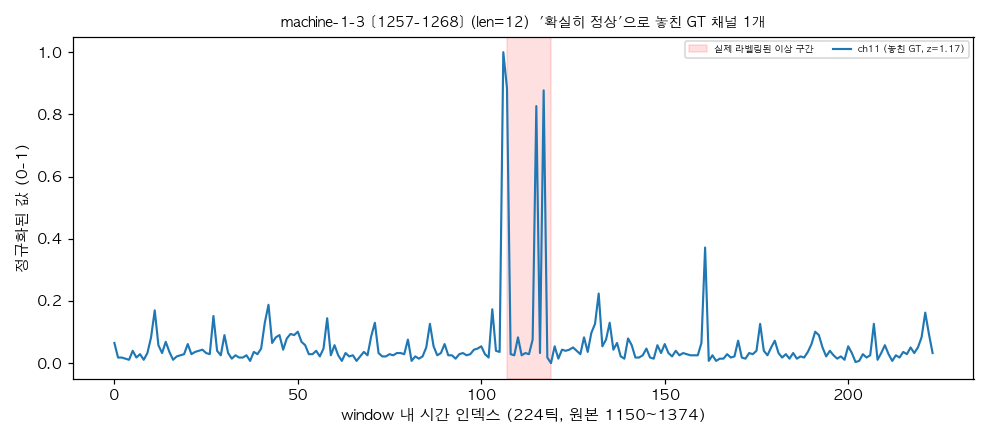

## machine-1-2 [22264-22336] (k=4, 놓친 채널 1개)

- 놓친 채널(z): [(3, 0.69)]

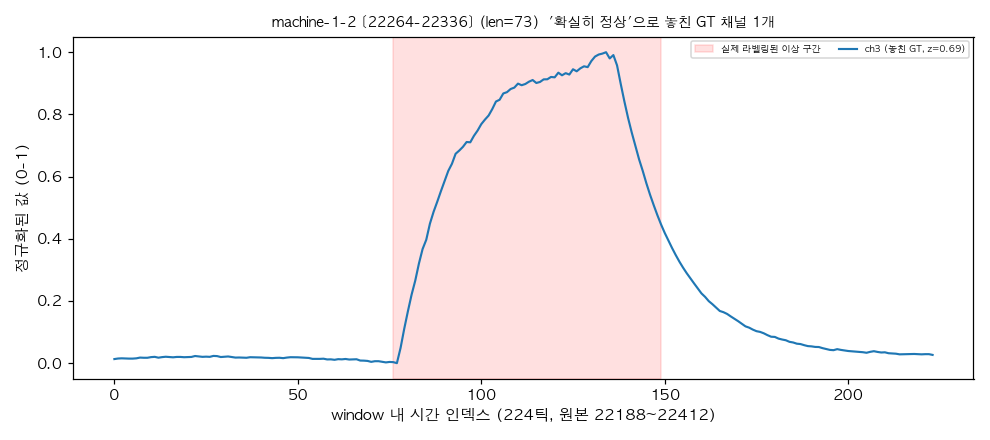

## machine-1-2 [20235-20271] (k=6, 놓친 채널 1개)

- 놓친 채널(z): [(19, -1.12)]

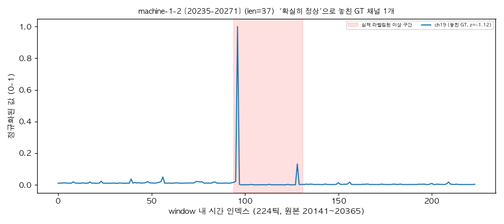

## machine-1-5 [10620-10637] (k=8, 놓친 채널 1개)

- 놓친 채널(z): [(31, -0.04)]

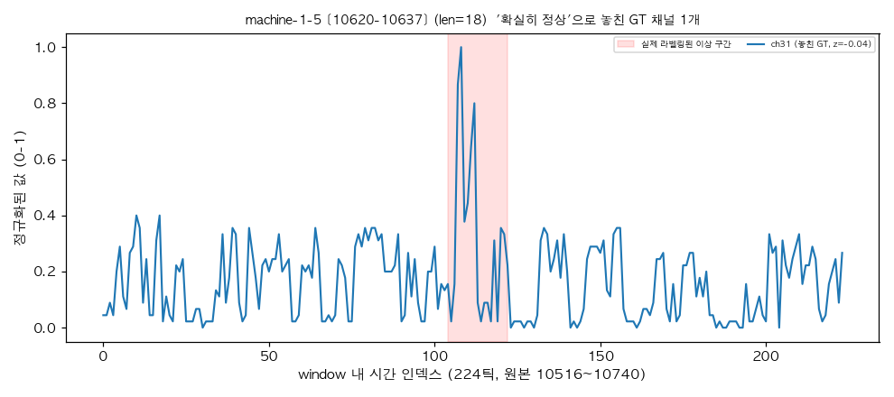

## machine-1-5 [11785-11816] (k=10, 놓친 채널 1개)

- 놓친 채널(z): [(8, 0.95)]

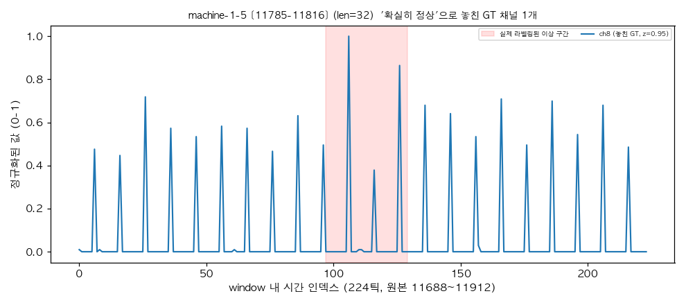

## machine-1-3 [4872-4875] (k=2, 놓친 채널 2개)

- 놓친 채널(z): [(11, 0.42), (14, 0.95)]

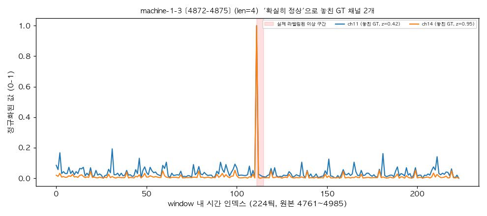

## machine-1-4 [16240-16261] (k=14, 놓친 채널 2개)

- 놓친 채널(z): [(23, -0.73), (25, -0.64)]

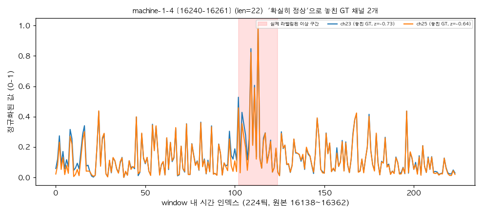

## machine-1-1 [15849-16368] (k=7, 놓친 채널 3개)

- 놓친 채널(z): [(14, -0.19), (11, 0.5), (8, 1.07)]

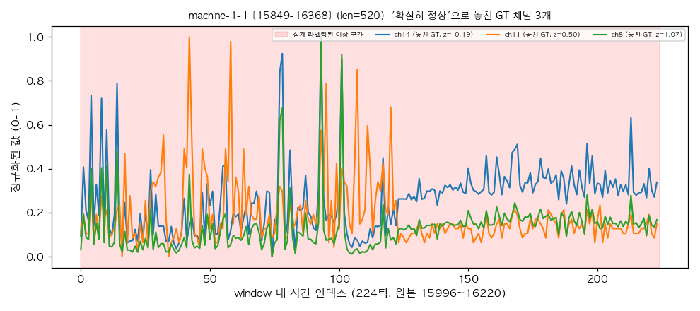

## machine-1-2 [15925-15973] (k=8, 놓친 채널 3개)

- 놓친 채널(z): [(9, -0.18), (13, 0.4), (19, 0.45)]

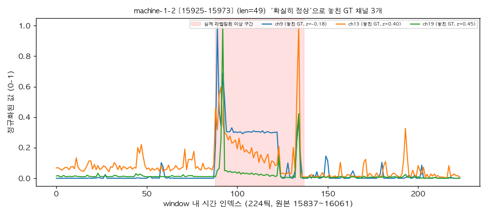

## machine-1-2 [23093-23115] (k=10, 놓친 채널 3개)

- 놓친 채널(z): [(3, -0.14), (6, 0.46), (0, 0.85)]

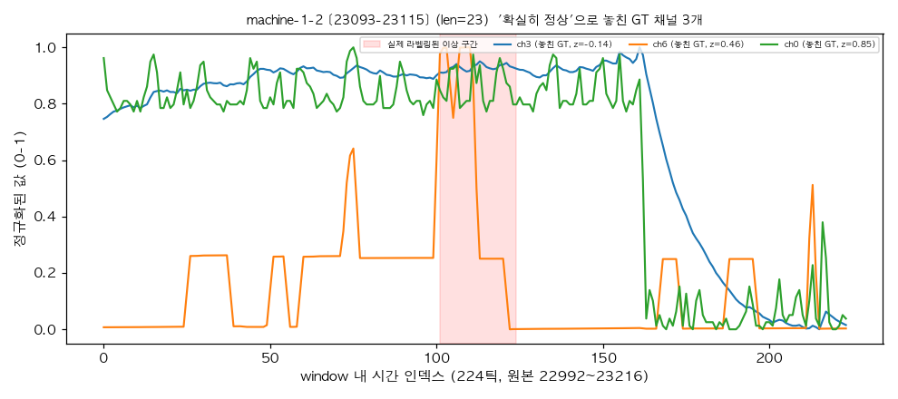

## machine-1-3 [16220-16281] (k=10, 놓친 채널 3개)

- 놓친 채널(z): [(23, -0.27), (25, 0.33), (24, 1.04)]

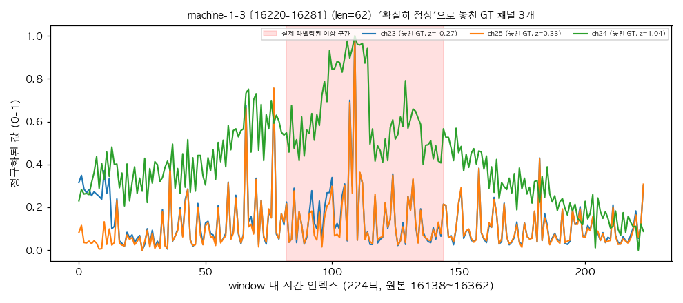

## machine-1-2 [5875-5951] (k=14, 놓친 채널 3개)

- 놓친 채널(z): [(9, -0.27), (11, 0.76), (1, 1.06)]

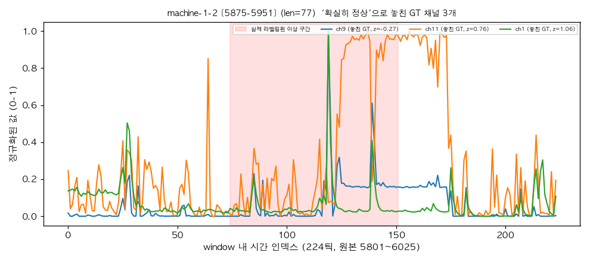

## machine-1-2 [4629-4688] (k=6, 놓친 채널 4개)

- 놓친 채널(z): [(8, 0.06), (14, 0.08), (9, 0.08), (10, 0.72)]

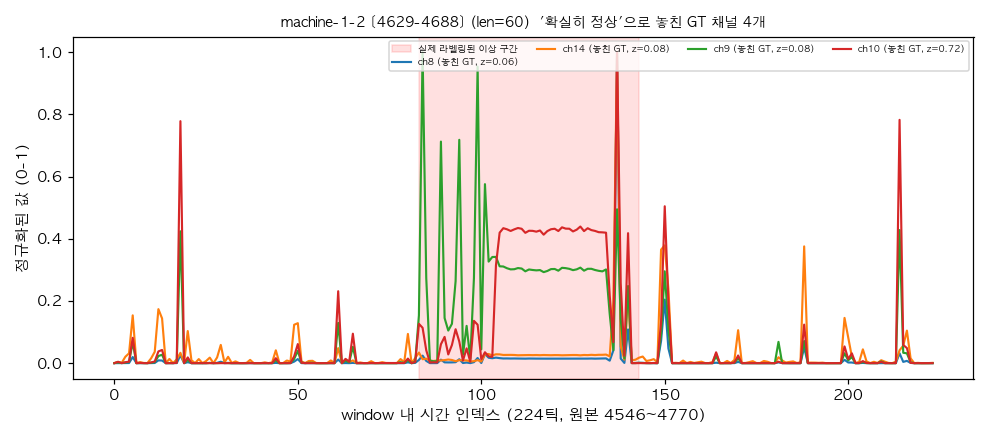

## machine-1-1 [20786-21195] (k=7, 놓친 채널 4개)

- 놓친 채널(z): [(9, -0.39), (11, 0.42), (14, 0.51), (8, 0.78)]

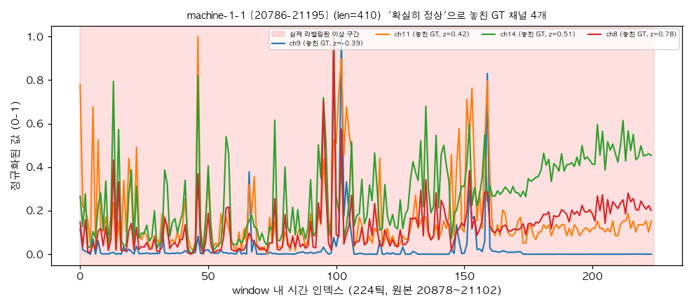

## machine-1-3 [13350-13380] (k=14, 놓친 채널 4개)

- 놓친 채널(z): [(34, 0.52), (35, 0.75), (23, 1.16), (24, 1.28)]

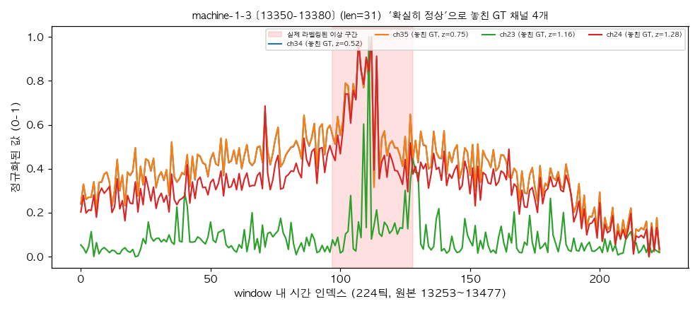

## machine-1-1 [18071-18528] (k=8, 놓친 채널 5개)

- 놓친 채널(z): [(14, -0.21), (8, 0.57), (9, 0.57), (11, 0.76), (13, 1.12)]

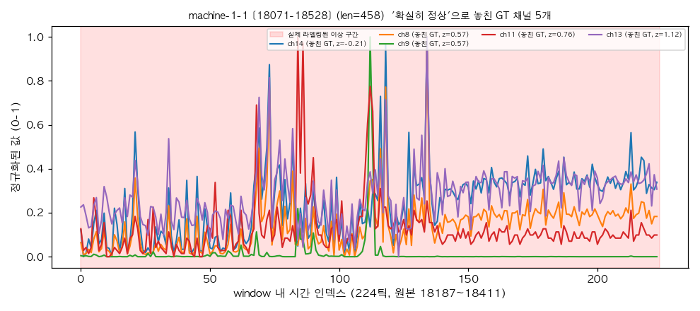

## machine-1-3 [17660-17716] (k=8, 놓친 채널 5개)

- 놓친 채널(z): [(19, -0.25), (22, -0.22), (20, -0.04), (21, 0.06), (18, 0.69)]

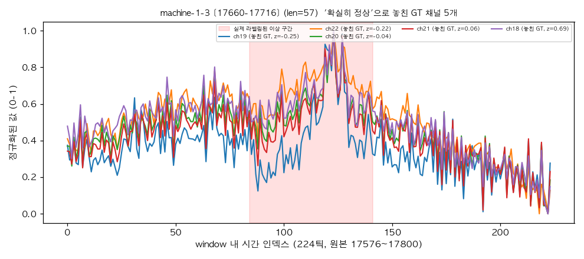

## machine-1-1 [19367-20088] (k=14, 놓친 채널 5개)

- 놓친 채널(z): [(9, -0.39), (15, 0.34), (10, 0.54), (14, 0.97), (11, 1.04)]

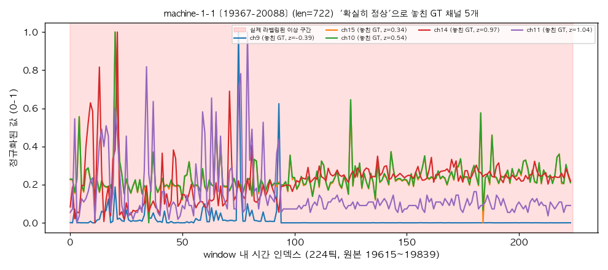

## machine-1-5 [14520-14531] (k=18, 놓친 채널 6개)

- 놓친 채널(z): [(9, -1.04), (10, -0.0), (34, 0.62), (35, 0.63), (30, 1.03), (24, 1.06)]

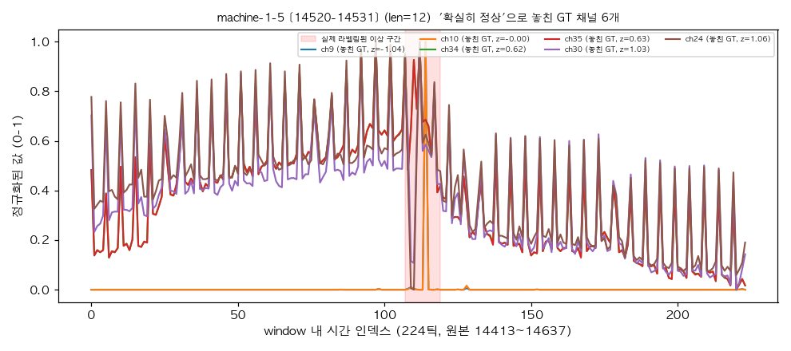

## machine-1-2 [18645-18801] (k=14, 놓친 채널 10개)

- 놓친 채널(z): [(0, -0.64), (18, -0.45), (6, -0.38), (20, -0.14), (21, -0.09), (30, 0.1), (10, 0.12), (19, 0.34), (5, 0.4), (11, 0.76)]

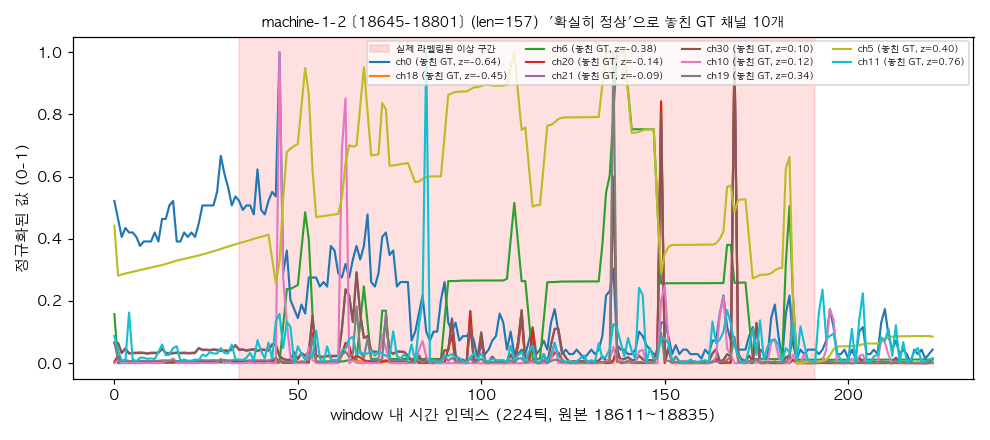

## machine-1-4 [13872-13925] (k=14, 놓친 채널 12개)

- 놓친 채널(z): [(18, -0.48), (27, -0.33), (21, -0.08), (31, -0.06), (20, -0.04), (19, 0.06), (30, 0.07), (35, 0.44), (25, 0.55), (34, 0.66), (24, 0.68), (0, 0.78)]

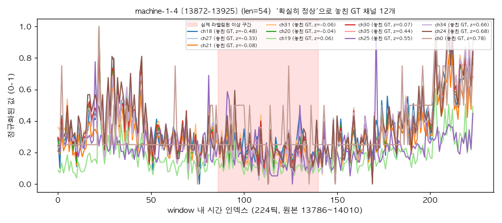

## machine-1-1 [16963-17517] (k=31, 놓친 채널 14개)

- 놓친 채널(z): [(15, -0.44), (10, -0.15), (26, 0.0), (14, 0.11), (11, 0.14), (32, 0.3), (9, 0.43), (3, 0.44), (6, 0.45), (29, 0.59), (13, 0.65), (8, 0.75), (34, 1.01), (35, 1.18)]

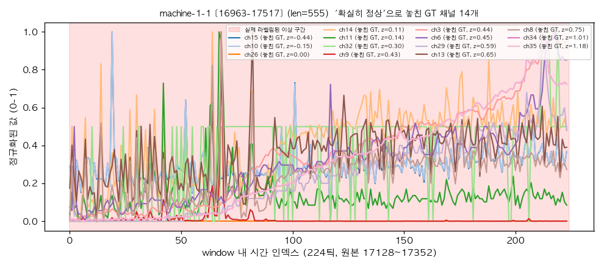
