# k=4-8 구간 실패 사례 (recall@8 < 1.0)

k=4-8 구간 총 16개 세그먼트 중 13개가 recall@8<1.0 (GT 채널을 top-8 안에서 다 못 찾음). 굵은 검은선=GT 채널, 가는 색선=우리가 대신 잘못 고른 top-8 채널, 빨간 음영=실제 라벨링된 이상 구간.

## machine-1-2 [4629-4688] (len=60)

- k=6, GT 채널=[8, 9, 10, 12, 14, 17], 우리 top-8=[2, 3, 12, 16, 20, 22, 32, 35]
- hit=1/8, precision@8=0.12, recall@8=0.17

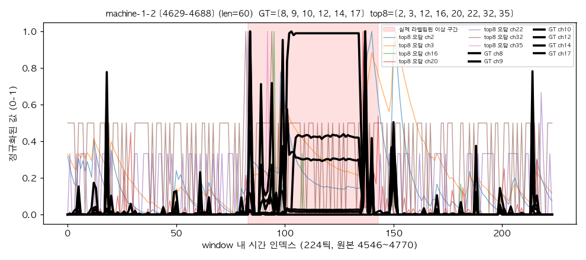

## machine-1-1 [18071-18528] (len=458)

- k=8, GT 채널=[0, 1, 8, 9, 11, 12, 13, 14], 우리 top-8=[0, 2, 12, 18, 24, 25, 29, 31]
- hit=2/8, precision@8=0.25, recall@8=0.25

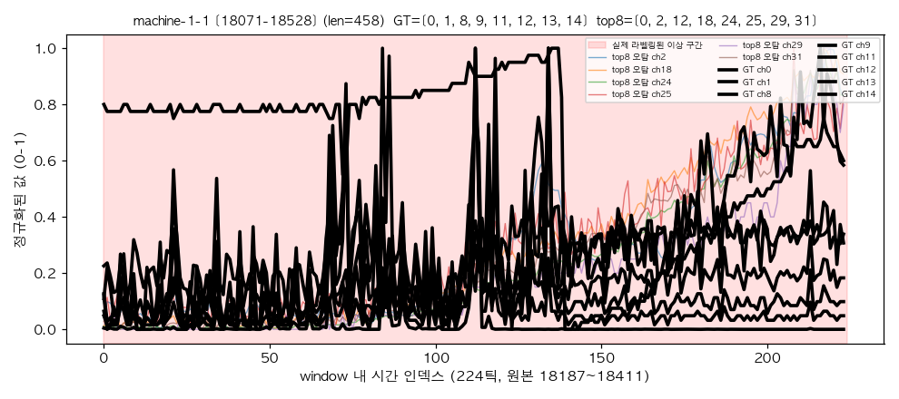

## machine-1-3 [17660-17716] (len=57)

- k=8, GT 채널=[18, 19, 20, 21, 22, 29, 32, 33], 우리 top-8=[8, 9, 10, 11, 14, 15, 32, 33]
- hit=2/8, precision@8=0.25, recall@8=0.25

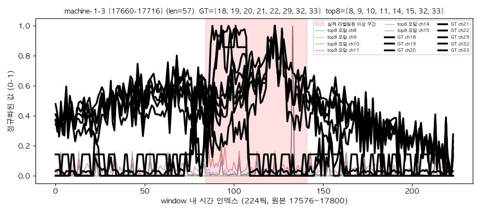

## machine-1-1 [15849-16368] (len=520)

- k=7, GT 채널=[0, 8, 9, 11, 12, 13, 14], 우리 top-8=[0, 2, 12, 20, 22, 24, 29, 31]
- hit=2/8, precision@8=0.25, recall@8=0.29

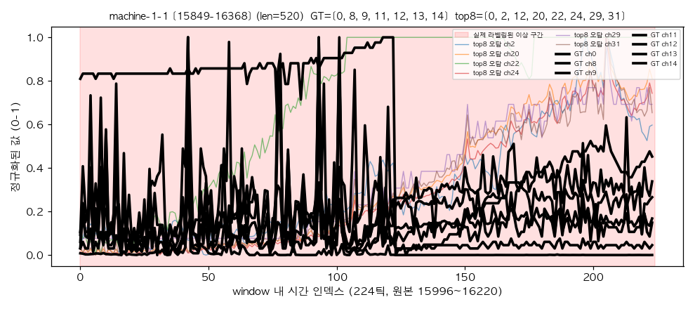

## machine-1-1 [20786-21195] (len=410)

- k=7, GT 채널=[0, 8, 9, 11, 12, 13, 14], 우리 top-8=[0, 12, 18, 20, 21, 24, 25, 31]
- hit=2/8, precision@8=0.25, recall@8=0.29

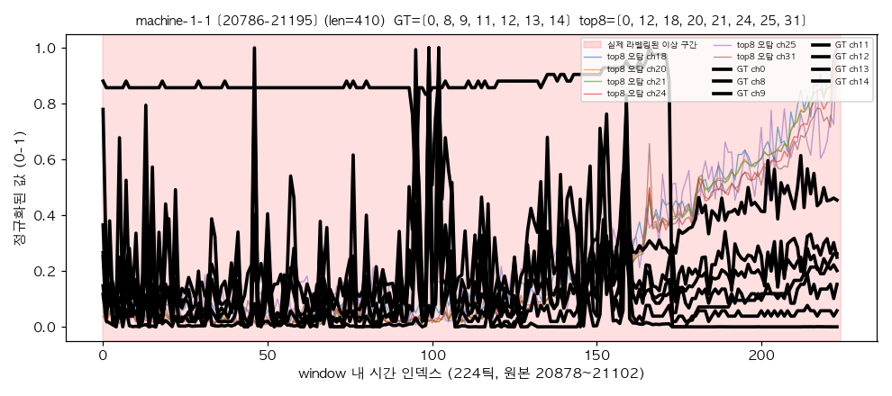

## machine-1-2 [20235-20271] (len=37)

- k=6, GT 채널=[5, 6, 11, 12, 19, 29], 우리 top-8=[5, 12, 18, 20, 22, 24, 34, 35]
- hit=2/8, precision@8=0.25, recall@8=0.33

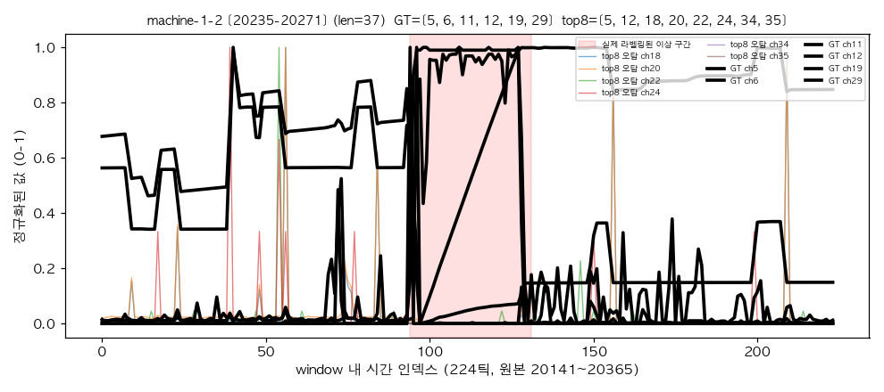

## machine-1-2 [15925-15973] (len=49)

- k=8, GT 채널=[5, 6, 9, 10, 12, 13, 19, 29], 우리 top-8=[5, 12, 16, 18, 19, 22, 24, 32]
- hit=3/8, precision@8=0.38, recall@8=0.38

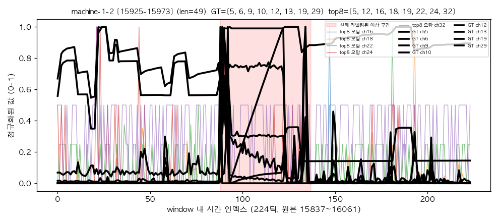

## machine-1-2 [22264-22336] (len=73)

- k=4, GT 채널=[0, 1, 2, 3], 우리 top-8=[0, 3, 6, 18, 22, 23, 24, 25]
- hit=2/8, precision@8=0.25, recall@8=0.50

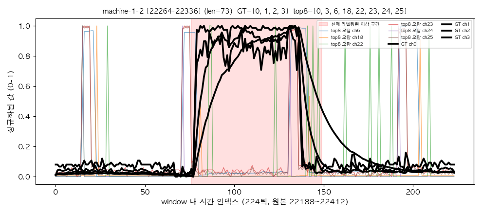

## machine-1-1 [24679-24682] (len=4)

- k=4, GT 채널=[8, 12, 13, 14], 우리 top-8=[8, 12, 13, 19, 20, 24, 34, 35]
- hit=3/8, precision@8=0.38, recall@8=0.75

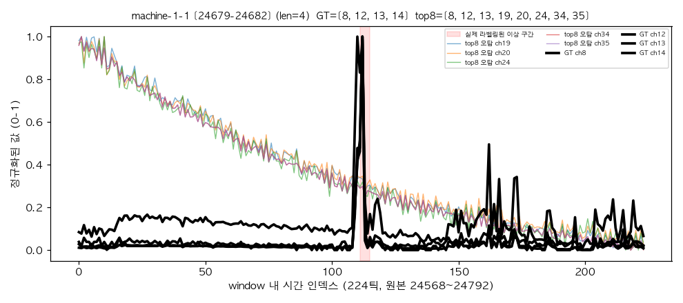

## machine-1-1 [26114-26116] (len=3)

- k=4, GT 채널=[8, 12, 13, 14], 우리 top-8=[8, 12, 13, 20, 21, 24, 27, 31]
- hit=3/8, precision@8=0.38, recall@8=0.75

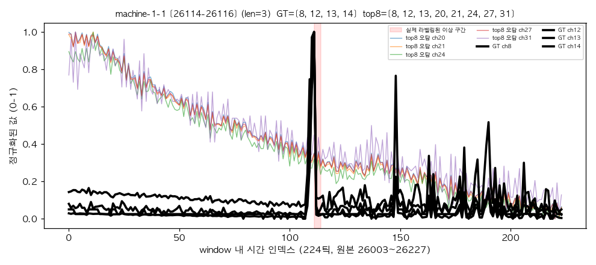

## machine-1-5 [10620-10637] (len=18)

- k=8, GT 채널=[0, 1, 2, 3, 6, 23, 25, 31], 우리 top-8=[0, 1, 2, 3, 22, 23, 25, 34]
- hit=6/8, precision@8=0.75, recall@8=0.75

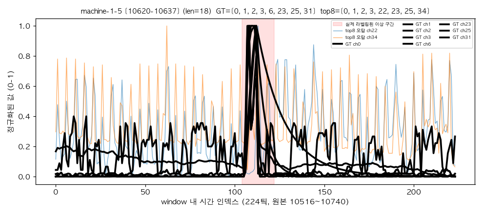

## machine-1-5 [22072-22077] (len=6)

- k=8, GT 채널=[18, 19, 20, 21, 23, 25, 27, 30], 우리 top-8=[19, 20, 21, 23, 25, 27, 34, 35]
- hit=6/8, precision@8=0.75, recall@8=0.75

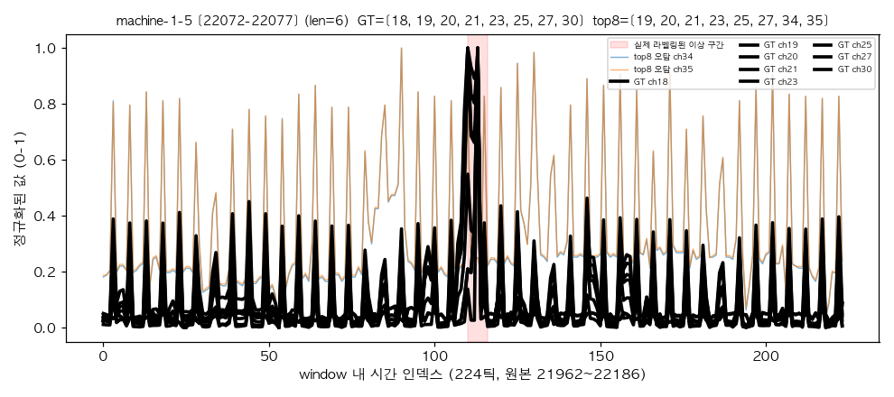

## machine-1-5 [21287-21298] (len=12)

- k=8, GT 채널=[0, 1, 2, 3, 5, 6, 23, 25], 우리 top-8=[0, 1, 2, 3, 6, 20, 23, 25]
- hit=7/8, precision@8=0.88, recall@8=0.88

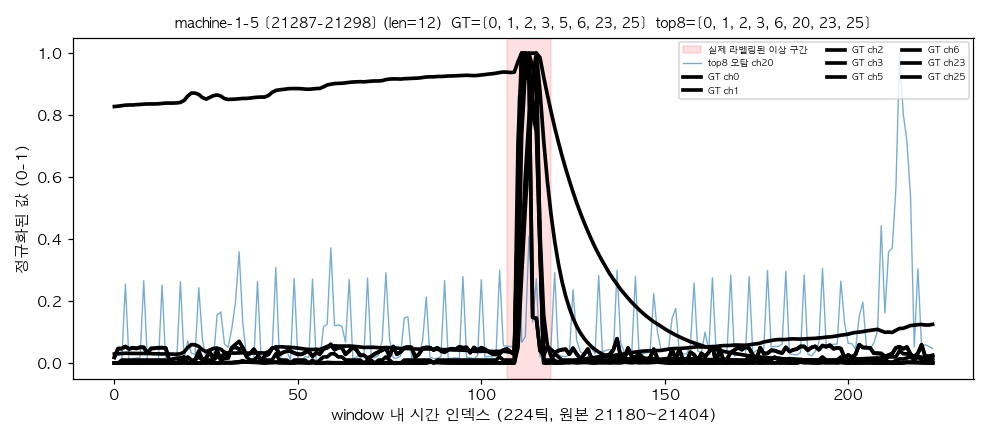
