# Sanity-1 Phase-Portrait 실험 리포트

**실행일**: 2026-07-16
**모델**: gpt-4o (temperature=0)
**샘플 수**: 210 (C0~C6, 각 30개)
**Run ID**: `20260716_065003`
**코드**: `VLM4TS/sanity/run_sanity1_phaseportrait.py`, `visualize.py::render_phase_portrait`, `vlm_client.py::call_multi`, `prompts.py::SANITY1_PHASEPORTRAIT_PROMPT`

이 리포트는 기존 `run_sanity1.py`(시계열 오버레이 1장 입력)를 **덮어쓰지 않고** 별도 스크립트/결과 폴더로 병행 실행한 결과다. 기존 baseline 코드/결과는 그대로 git 히스토리에 남아 있다.

---

## 1. 배경 및 가설

이전 Sanity-1~7 실험(`project_mtsad_sanity_results` 메모리 참고)에서 두 유형이 프롬프트·후보 개선을 거듭해도 끝까지 풀리지 않았다.

- **C3 (위상반전)**: 중간 구간에서 Channel B가 `-Channel A`로 뒤집혔다가 복귀. Baseline 20%.
- **C5 (미세 주파수 변화)**: 중간 구간에서 주파수가 5~10% 미세하게 달라짐. Baseline 3.3% — 모든 실험을 통틀어 단 한 번도 개선된 적 없는 유일한 패턴.

가설: 두 유형 모두 "진폭·평균은 그대로인데 관계(위상/주기)만 미세하게 달라지는" 유형이라, **시간축 겹침 그래프**에서는 두 곡선이 여전히 비슷하게 출렁여 육안 차이가 거의 없다. 반면 **Channel A를 x축, Channel B를 y축으로 삼는 phase portrait**(위상 초상화)로 재표현하면:
- 정상: 궤적이 사이클마다 같은 모양(직선/닫힌 루프)을 반복해서 그린다.
- 위상반전(C3): 궤적이 반대 방향 대각선으로 순간 이동한다 → X자 모양.
- 주파수 드리프트(C5/C4): 사이클마다 궤적이 조금씩 어긋나며 루프가 점점 벌어진다 → 나선형(spiral) 모양.

즉 "시간에 따른 미세한 변화 추적"이라는 VLM이 약한 과제를, "이 도형이 원래 모양과 다른가"라는 상대적으로 강한 과제로 바꿔주는 것이 핵심 아이디어다.

## 2. 방법

### 2.1 이미지 구성 (2장 입력)

| Plot 1: 시계열 오버레이 (기존 Sanity-1과 동일) | Plot 2: Phase portrait (신규) |
|---|---|
| x=시간, y=값. Channel A/B를 색으로 구분 | x=Channel A 값, y=Channel B 값. 선 색은 **시간 진행**을 viridis 컬러맵으로 인코딩(어두운 보라=초반, 밝은 노랑=후반) |

Phase portrait는 어떤 시점이 이상인지 직접 알려주지 않도록(라벨 누설 방지), 붕괴 구간을 강조색으로 칠하지 않고 오직 "시간 진행"이라는 라벨-무관 정보만 색으로 인코딩했다.

### 2.2 프롬프트

`SANITY1_PHASEPORTRAIT_PROMPT`는 Sanity-1과 동일한 JSON 스키마(`answer`/`reason`/`confidence`)를 사용해 baseline과 직접 비교 가능하게 설계했다. 두 이미지의 의미를 설명하고, "관계가 유지되면 모든 시간대의 궤적이 같은 도형 위에 겹친다. 깨지면 어느 시간대든 소수의 구간이 다수의 도형에서 벗어난다"고 명시했다.

**세션 중 프롬프트 1회 수정 기록** (재현성을 위해 기록): 최초 버전은 "후반 색이 초반 색과 달라지면 이상"이라는 문구를 썼는데, 이는 끝점 비교로 모델을 편향시켜 C3(중간만 잠깐 붕괴, 끝은 정상 복귀)에서 작은 스모크테스트(n=2) 기준 0/2로 완전히 실패했다. "궤적 전체를 스캔해서 어느 시간대든 다수 도형에서 벗어난 구간이 있는지 보라"로 수정 후 작은 스모크테스트(n=2~3)에서는 개선되었으나(§4.3 참고), 아래에서 보듯 본 실험(n=30)에서는 C3에 대해 이 수정이 충분치 않았다.

### 2.3 검증 절차 (비용 관리)

API 키가 실제 과금되는 리소스이므로, 아래 순서로 코드를 완성하고 나서야 본 실험을 실행했다:
1. `--dry-run`(Mock 클라이언트, 비용 0)으로 파이프라인 전체(이미지 생성 → 체크포인트 → 파싱 → 지표 계산) 검증
2. 실제 API로 n=2/case 스모크테스트(14 콜) — 여기서 프롬프트 편향 문제 발견 및 수정
3. 수정 후 C3/C5/C6만 n=3로 재확인(9 콜)
4. 본 실험 n=30 전체 실행(210 콜)

---

## 3. 전체 결과

| Case | 패턴 | Baseline (시계열만, Sanity-1) | Phase-portrait (2장) | 변화 |
|---|---|---:|---:|---:|
| C0 | 정상 대조군 | — | 1.000 | |
| C1 | 진폭 점프 | — | 1.000 | |
| C2 | Flatline | 1.000 | 1.000 | 0 |
| C3 | 위상반전 (중간, 복귀) | 0.200 | **0.100** | **-0.100** |
| C4 | 점진적 위상 이탈 | boundary(임계값 미적용) | 1.000 | |
| C5 | 미세 주파수 변화 | 0.033 | **0.700** | **+0.667** |
| C6 | 노이즈만 (정상 대조군) | — | 0.733 (90% 기준 미달) | 신규 FP |
| **전체** | | **0.676** | **0.790** | **+0.114** |

Precision(broken)=0.934, Recall(broken)=0.760, F1(broken)=0.838 (전체 phase-portrait 기준).

---

## 4. Case별 상세 분석 (이미지 포함)

### 4.1 C0 — 정상 대조군 (정답, 1.000)

시계열 오버레이:

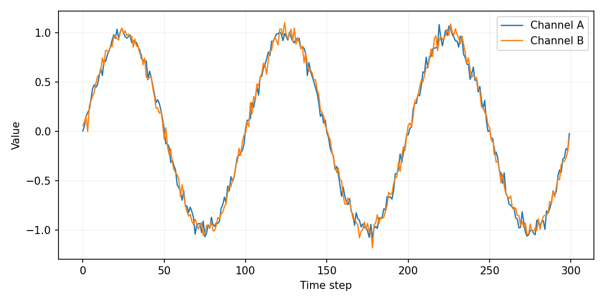

Phase portrait:

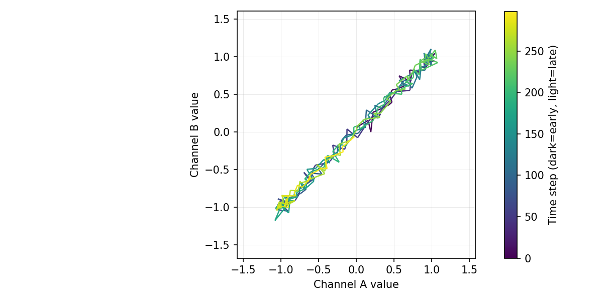

두 채널이 노이즈 수준(σ=0.05)만 다를 뿐 완전히 동기화되어 있어, phase portrait는 초반(보라)부터 후반(노랑)까지 모든 시간대가 **거의 완벽한 대각선 위에 겹쳐서** 그려진다. 모델 응답: *"consistent linear trajectory with no visible deviations"* — 정확한 판단.

### 4.2 C1 — 진폭 점프 (정답, 1.000)

Phase portrait:

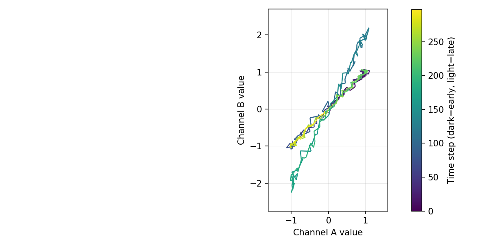

중간 구간(t=100~200)에서 Channel B의 진폭이 2배로 커지는 유형. Phase portrait에서는 이 구간이 기울기는 비슷하지만 **더 넓은 범위로 벌어진 궤적**(위쪽은 y=2 부근까지, 아래는 y=-2 부근까지)으로 뚜렷하게 드러난다. Baseline도 이미 잘 맞히던 "뚜렷한 이상" 유형이라 성능 변화는 크지 않지만, phase portrait가 이런 유형에서 성능을 깎아먹지 않는다는 걸 확인했다.

### 4.3 C2 — Flatline (정답, 1.000)

시계열 오버레이:

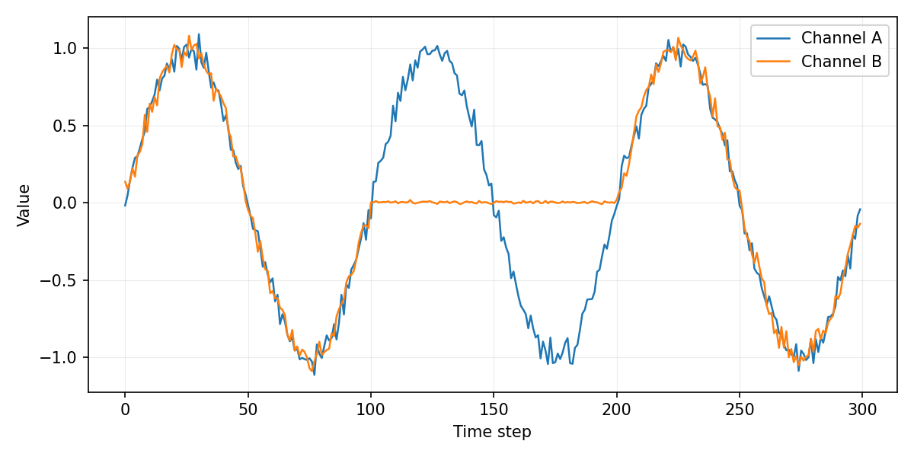

Phase portrait:

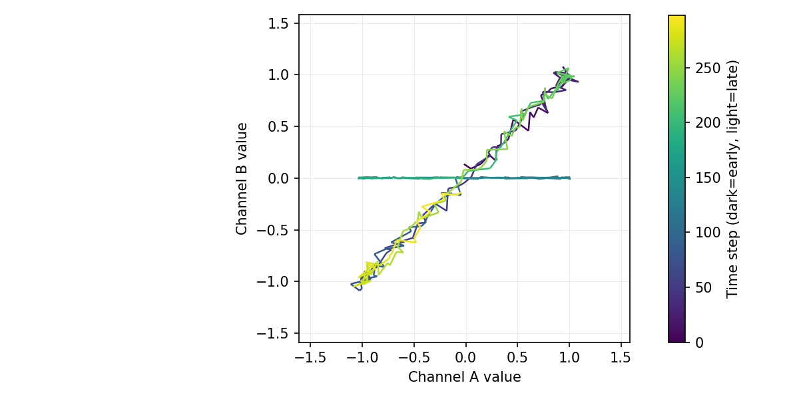

Channel B가 중간 구간에서 0 근처로 flatline되는 유형. Phase portrait에서는 이 구간의 궤적이 **y=0 근처 수평선**으로 완전히 무너져, "다수 도형(대각선)에서 명백히 이탈"이 극적으로 드러난다. 모델도 정확히 이 패턴을 짚어 설명했다: *"Channel B remains constant while Channel A varies"*.

### 4.4 C3 — 위상반전 (오답 다수, 0.100 — **오히려 악화**)

**성공 사례 (C3_002, 30개 중 3개뿐)**

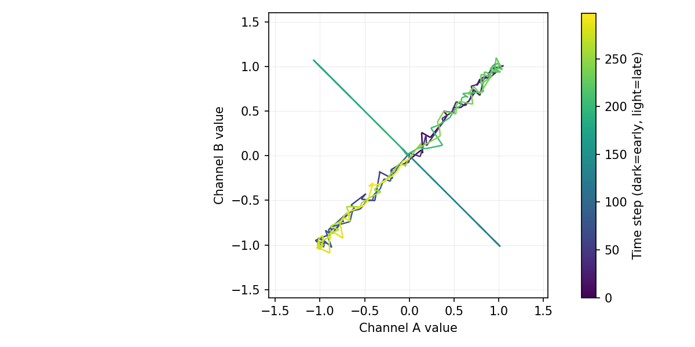

모델 응답: *"deviation from the dominant linear trajectory, indicating a breakdown"* — 짧고 일반적인 문구지만 정답.

**실패 사례 (C3_000, 30개 중 27개 이런 식)**

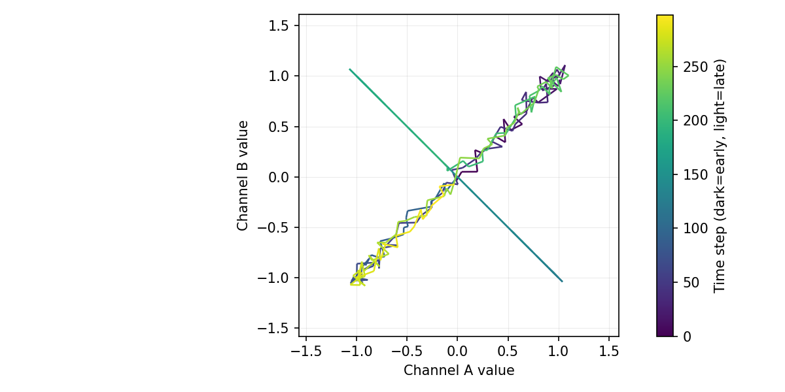

모델 응답: *"a consistent linear relationship... throughout the entire interval, with no visible deviations"* — **명백한 오독**이다. 이미지를 직접 확인하면 teal색(t≈150 부근) 궤적이 원래 대각선을 완전히 벗어나 **반대 방향 대각선(X자)**을 그리고 있다. 두 이미지(C3_002, C3_000)를 나란히 보면 육안으로는 거의 구분이 안 될 만큼 유사한 X자 패턴인데도 모델의 답은 정반대로 갈린다.

**분석**: C3의 붕괴는 "중간에 잠깐 반전됐다가 끝에는 원래대로 복귀"하는 유형이라, 궤적의 **다수(초반+후반 색)는 여전히 원래 대각선 위**에 있고 오직 **소수(중간 시간대 색)만** 반대 대각선을 그린다. 프롬프트에 "다수 모양에서 벗어난 소수 구간도 스캔하라"고 명시했음에도(§2.2), 모델은 "대부분이 겹쳐 있다"는 다수결적 인상에 강하게 끌려 소수 이탈 구간을 사실상 무시하는 것으로 보인다. 이는 이미지 해상도나 채도 문제(perception)라기보다 **의사결정 규칙이 다수/소수 판단에 편향**되어 있다는 신호이며, 프롬프트 문구 조정만으로는 (적어도 이번 시도로는) 교정되지 않았다. Baseline(20%)보다도 낮아졌다는 것은, 오히려 phase portrait가 "대체로 겹쳐 보인다"는 잘못된 확신을 강화했을 가능성을 시사한다 — confidence는 두 사례 모두 0.95로 동일하게 높다.

### 4.5 C4 — 점진적 위상 이탈 (정답, 1.000)

시계열 오버레이:

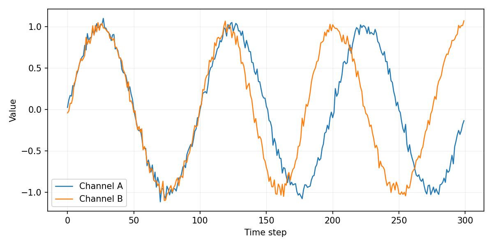

Phase portrait:

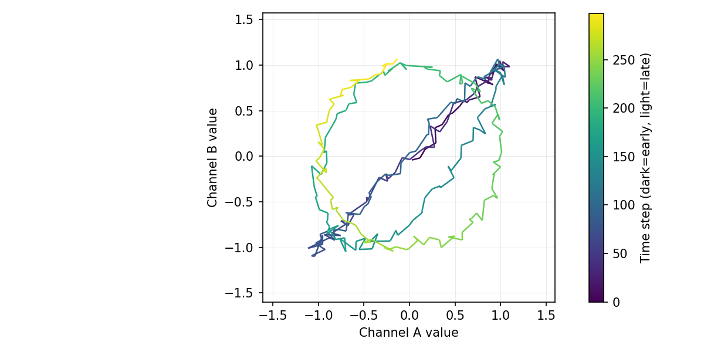

위상이 t=100~200 구간 동안 0→90°까지 점진적으로 벌어지고 이후 그 상태로 고정되는 유형. Phase portrait는 이 실험에서 **가장 극적인 시각적 효과**를 보여준다 — 초반(보라)은 얇은 대각선이지만 시간이 지날수록(청록→초록→노랑) 궤적이 점점 넓게 벌어지는 **나선형(spiral)** 모양을 그린다. 이는 §1의 가설(주기적 드리프트 → 벌어지는 루프)이 그대로 시각적으로 확인된 사례다. 모델도 정확히 짚었다: *"segments of different colors not overlapping the dominant trajectory"*.

### 4.6 C5 — 미세 주파수 변화 (0.033 → **0.700, 최대 개선**)

**성공 사례 (C5_000)**

시계열 오버레이:

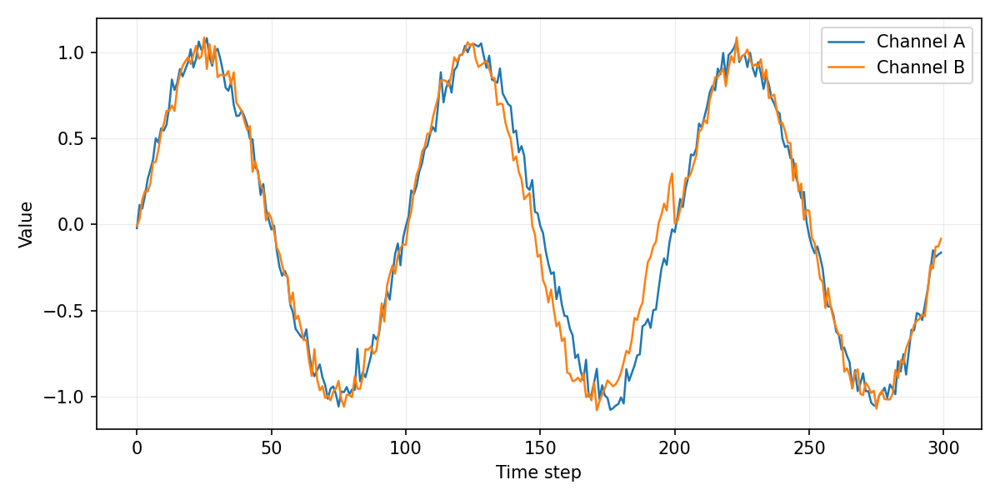

시간축에서는 두 곡선이 거의 완벽하게 겹쳐 보여 baseline이 3.3%(30개 중 1개)만 맞혔던 이유를 바로 알 수 있다.

Phase portrait:

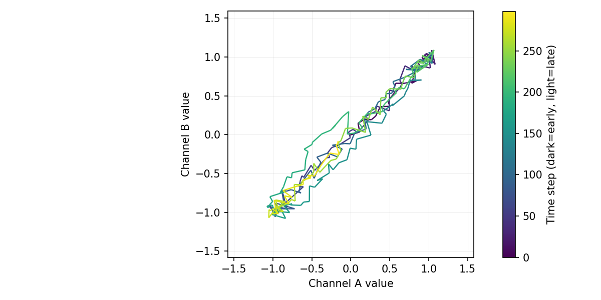

같은 데이터인데도 phase portrait에서는 teal~초록 구간(중간 시간대)에서 궤적이 대각선을 살짝 벗어나 **가느다란 잎(leaf) 모양의 편차**를 그리는 게 보인다. 모델 응답: *"some segments diverging from the main line"* (confidence 0.85로 다른 케이스보다 낮음 — 미세한 편차라 모델도 확신은 덜함을 시사).

**실패 사례 (C5_006)**

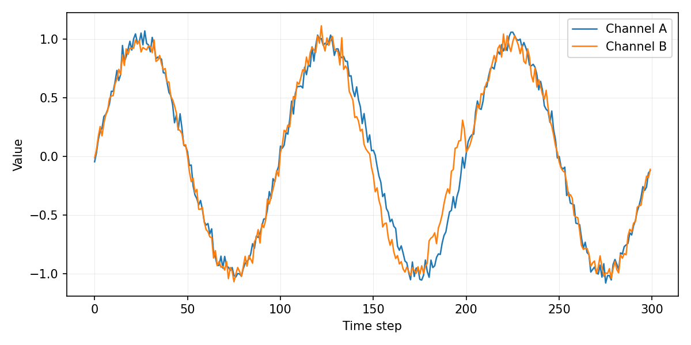
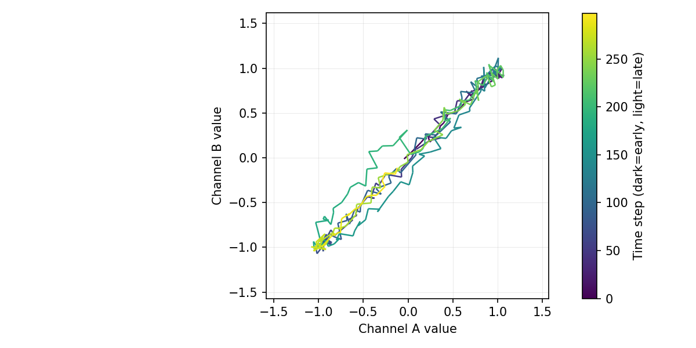

흥미롭게도 C5_006의 phase portrait 편차는 C5_000보다 **오히려 더 뚜렷해 보인다**(중간에 더 넓은 루프). 그런데도 모델은 *"consistent linear trajectory with no significant deviations"*(confidence 0.95)라고 정반대로 답했다. C3와 마찬가지로, 시각적 뚜렷함과 모델의 최종 판단 사이에 **일관되지 않은 임계값**이 존재함을 보여준다 — 즉 C5의 개선(3.3%→70%)은 "이제 항상 인식한다"가 아니라 "이제 상당수 사례에서 인식한다"는 확률적 개선이다.

### 4.7 C6 — 노이즈만 있는 정상 대조군 (0.733, **90% 기준 미달 — 신규 FP**)

**오탐 사례 (C6_000, gt=maintained, pred=broken)**

시계열 오버레이:

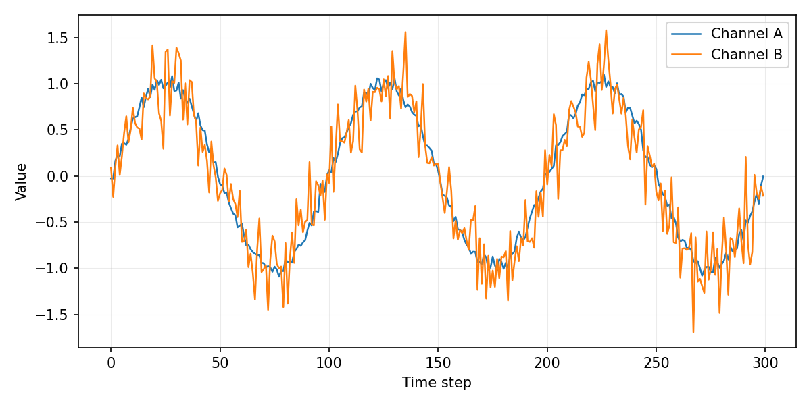

Phase portrait:

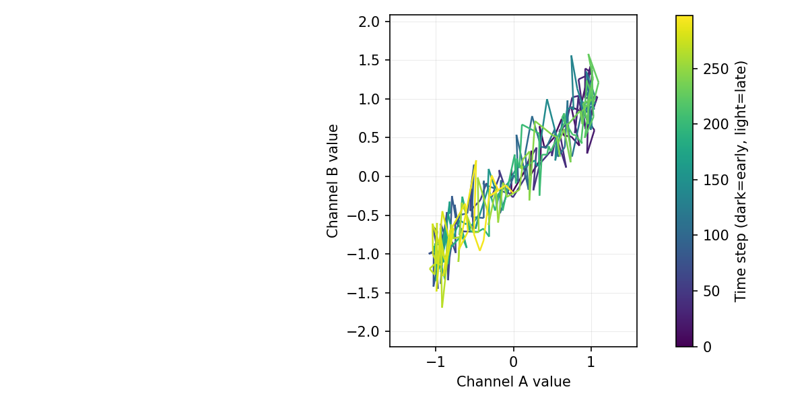

Channel B의 노이즈 σ가 원본의 4~6배로 커진 것뿐, 관계 자체(추세)는 깨지지 않은 정상 케이스다. 하지만 phase portrait에서는 노이즈가 궤적을 대각선 주변으로 **두껍게 흩뿌려서**, 특히 노랑(후반) 구간의 삐죽삐죽한 튐이 눈에 띈다. 모델은 이를 진짜 관계 붕괴로 오인했다: *"segments of different colors deviating from the dominant shape, indicating a breakdown"*.

**정답 사례 (C6_001, gt=maintained, pred=maintained)**

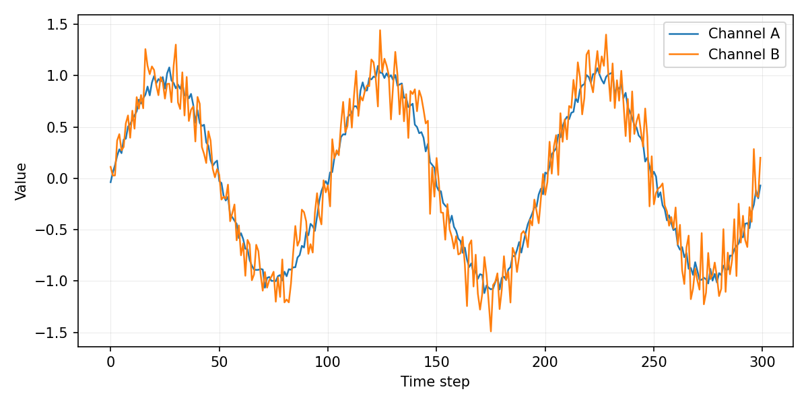
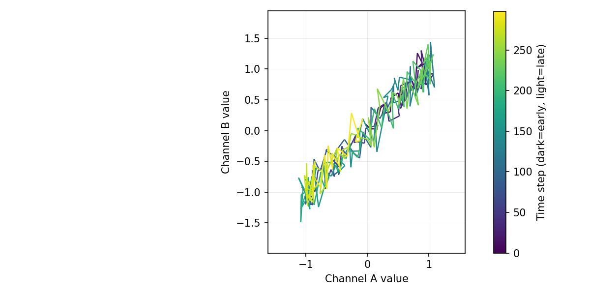

같은 유형이지만 노이즈 실현값이 상대적으로 덜 튀어서 "두꺼운 대각선 띠"로만 보이고 모델도 정상으로 판단했다.

**분석**: 시계열 오버레이만 볼 때는 baseline이 이런 순수 노이즈 케이스에서 매우 보수적(오탐 거의 없음, Precision 100%)이었는데, phase portrait를 추가하자 **노이즈가 만드는 궤적의 폭(width)과 진짜 관계 붕괴가 만드는 궤적의 이탈(shape change)을 혼동**하는 새로운 실패 모드가 생겼다. 이는 phase-portrait 방식이 감수해야 할 명확한 트레이드오프다.

---

## 5. 종합 결론

1. **가설의 핵심(C5)은 검증됨**: "시간에 따른 미세 변화"를 "정지 도형의 벌어짐"으로 재부호화하는 phase portrait는 그 어떤 이전 방법으로도 못 풀었던 C5를 3.3%→70.0%로 끌어올렸다. C4(점진적 드리프트) 사례에서 보듯 나선형으로 벌어지는 시각 효과가 실제로 강력하게 작동한다.
2. **C3(위상반전)에는 통하지 않음, 오히려 악화**: "중간에만 잠깐 붕괴했다가 복귀"하는 유형은 궤적의 다수가 여전히 정상 모양이라, 모델이 다수결적 인상("대체로 겹쳐 있다")에 끌려 소수 이탈 구간을 놓친다. 프롬프트 문구 조정(§2.2)만으로는 본 실험 규모(n=30)에서 교정되지 않았다.
3. **C6(노이즈 대조군)에서 신규 오탐 발생**: 노이즈가 만드는 궤적 폭 증가를 관계 붕괴로 오인하는 새로운 실패 모드. Baseline 대비 트레이드오프다.
4. **결론적으로 phase portrait는 시계열 오버레이를 대체할 게 아니라, 주파수/주기 드리프트 탐지에 특화된 보조 신호로 추가하는 편이 맞다.** C3형 "일시적 이탈"과 C6형 "노이즈 오탐"은 phase portrait만으로 해결되지 않으므로 별도 메커니즘(예: 다수/소수 판단 규칙 명시적 분리, 노이즈 폭 정규화 등)이 필요하다.

## 6. 다음 실험 제안

- **C3 전용 개선**: 궤적을 시간 구간별로 분할해(예: 3등분) 각 구간의 "지배적 모양"을 텍스트로 미리 계산해 알려주거나, "구간별로 따로 판단 후 종합"하는 2단계 프롬프트 시도.
- **C6 노이즈 강건성**: phase portrait에 궤적 폭(예: 국소 분산)에 대한 명시적 정규화 또는 별도 정보 제공 검토.
- **Sanity-3/4 스타일 localization**: 이번 실험은 분류(maintained/broken)만 다뤘다. Phase portrait는 절대 시간 정보를 잃으므로 구간 추정에는 그대로 쓸 수 없고, 시계열 오버레이와 병행해야 함.
